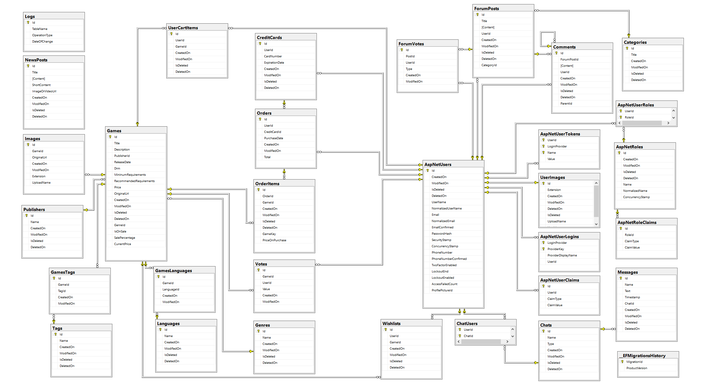

# Journey
Game Store

You can also find the site here:
https://journeystore.azurewebsites.net/

> Title page.
> 

> Database diagram.
---

### Table of Contents

- [Description](#description)
- [License](#license)
- [Info](#info)

---

#### Technologies

- ASP.NET Core MVC
- SQL Server
- Entity Framework Core
- SignalR

---

## Description

The Journey Game Store is project developed for a number of months, based on the ASP.NET-Core-Template by [NikolayIT](https://github.com/NikolayIT).

On the user side, you can browse the entire list of games, look for the game under a particular genre or those published by a certain company. You can also search by keyword. All the results of these operations can be sorted by title and price. The user can also browse the games that are currently on sale and order them by title, price, or discount amount.
The site has a Wishlist and Cart funcionality as well as a basic payment system and validation for adding credit cards (Visa and MasterCard only). The user has access to all the games they have purchased in their Library, receive a profile picture border and badge (different tiers) based on the number of games they have purchased and have access to a list of all their Orders which can be sorted by date of purchase and total price. They can also print a pseudo-receipt in JSON format.
The users can also give a 5-star rating for each game and discover other games by the same publisher at the bottom of each individual game page if there are any.

On the admin side, you can add a new game, filling the forms for its Title, Price, Description, including which languages it's translated in etc. When adding the images for the Game, there is one caveat - the image that is to be used as a main image needs to have "cover" in it's name.
Additionally, you can edit the game's Title, Price, Description, Genre, Publisher and Requirements. You can also add additional languages and tags (e.g. "Crossplatform", "Co-op" etc.) The admin has the ability to put any game on sale, choosing what percentage to cut from the base price. Finally, the admin can add a new Publisher, if the game/s they want to add aren't by an already existing one.

Journey also has a Newsletter section where the admins can add the latest news including images and videos. There is also a forum system where everyone can discuss different topics and rate the posts.

Finally there is Chat system with Public and Private rooms implemented with SignalR. Users can freely chat there asking any question they may have in a public room which only admins can create or add a user to a Private chat.

---

## License

MIT License

Copyright (c) [2021] [Stefan Denchev]

Permission is hereby granted, free of charge, to any person obtaining a copy of this software and associated documentation files (the "Software"), to deal in the Software without restriction, including without limitation the rights to use, copy, modify, merge, publish, distribute, sublicense, and/or sell copies of the Software, and to permit persons to whom the Software is furnished to do so, subject to the following conditions:

The above copyright notice and this permission notice shall be included in all copies or substantial portions of the Software.

THE SOFTWARE IS PROVIDED "AS IS", WITHOUT WARRANTY OF ANY KIND, EXPRESS OR IMPLIED, INCLUDING BUT NOT LIMITED TO THE WARRANTIES OF MERCHANTABILITY, FITNESS FOR A PARTICULAR PURPOSE AND NONINFRINGEMENT. IN NO EVENT SHALL THE AUTHORS OR COPYRIGHT HOLDERS BE LIABLE FOR ANY CLAIM, DAMAGES OR OTHER LIABILITY, WHETHER IN AN ACTION OF CONTRACT, TORT OR OTHERWISE, ARISING FROM, OUT OF OR IN CONNECTION WITH THE SOFTWARE OR THE USE OR OTHER DEALINGS IN THE SOFTWARE.

**The project is made purely for educational purposes.**

---

## Info

- LinkedIn - [stefan-denchev](https://www.linkedin.com/in/stefan-denchev-136772154/)

[Back To The Top](#journey)
